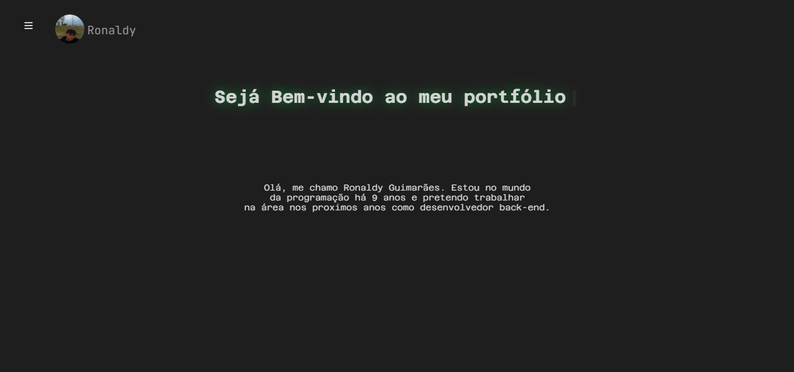
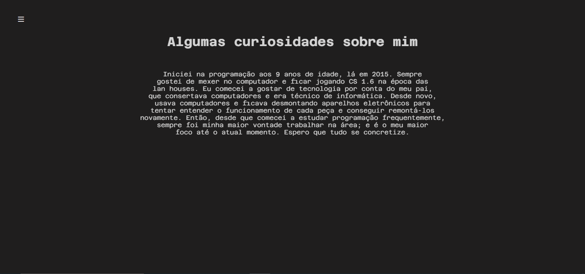
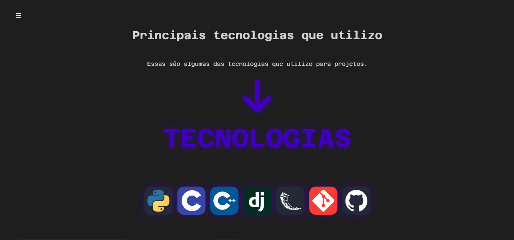
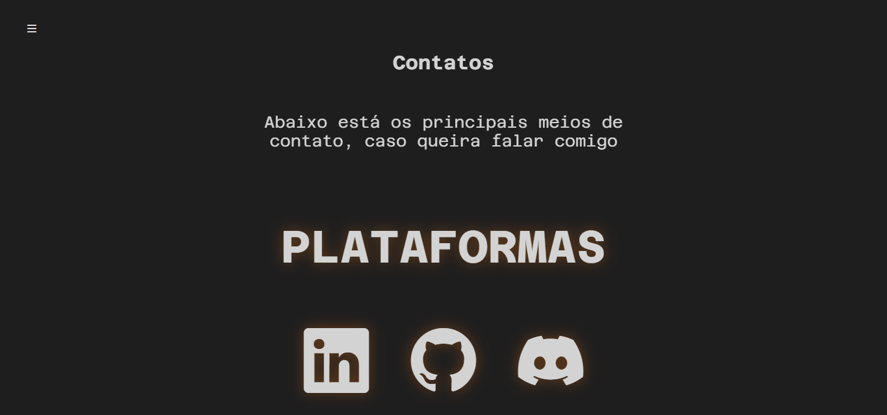

<h1 align="center">Projeto Teste de Portfólio</h1>

  
  
  

   
   

### Ajustes e melhorias

O projeto ainda está em desenvolvimento e as próximas atualizações serão voltadas para as seguintes tarefas:

-  Análise de projetos pessoais
-  Envio de pedido

## Tecnologias presentes

 

## 📝 Licença

Esse projeto está sob licença. Veja o arquivo [LICENÇA](https://github.com/ndzinxz) para mais detalhes.
